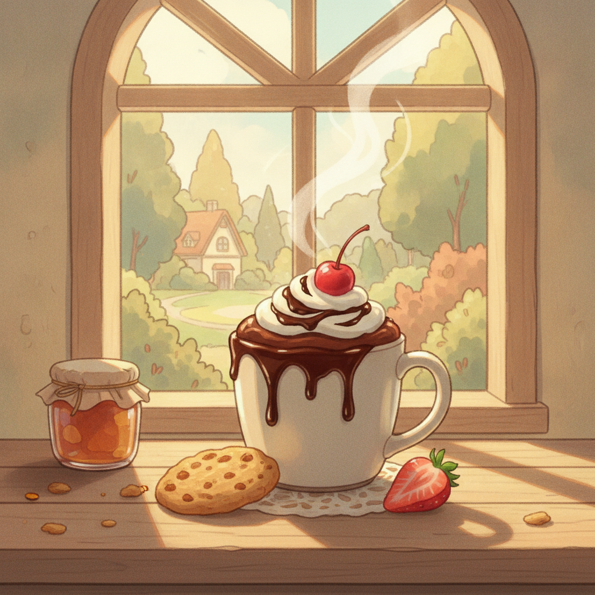

# 초코 무스 컵 (오븐 없이 15분 완성)

오븐 없이 냉장고와 전자레인지만으로 만드는 부드러운 초콜릿 무스 디저트예요.

## 재료 (2인분)

- 다크 초콜릿 100g (판초콜릿도 가능)
- 생크림 200ml (휘핑용)
- 우유 2큰술
- 설탕 1큰술
- 코코아 파우더 약간 (선택, 장식용)
- 딸기 또는 체리 2~3개 (장식용)
- 쿠키 부스러기 약간 (선택, 바닥에 깔기)

## 조리 순서

1. **초콜릿 녹이기 (3분)** — 다크 초콜릿을 잘게 잘라 우유와 함께 전자레인지에 30초씩 끊어가며 돌려 부드럽게 녹입니다.
2. **생크림 휘핑 (4분)** — 차가운 생크림에 설탕을 넣고 손 거품기나 핸드믹서로 부드러운 뿔이 설 때까지 휘핑합니다.
3. **섞기 (3분)** — 녹인 초콜릿을 한 김 식힌 뒤, 휘핑크림에 2~3번 나누어 넣으며 가볍게 섞어줍니다(너무 세게 섞으면 크림이 꺼지니 살살 섞어주세요).
4. **컵에 담기 (2분)** — 컵 바닥에 쿠키 부스러기를 살짝 깔고 그 위에 초코 무스를 부드럽게 채웁니다.
5. **냉장 및 장식 (3분)** — 냉장고에 잠시 넣어 살짝 굳힌 뒤, 코코아 파우더를 뿌리고 딸기나 체리로 장식해 완성합니다.

## 꿀팁

- 초콜릿을 녹일 때 물이 한 방울이라도 들어가면 분리되니 완전히 마른 그릇을 사용하세요.
- 급하게 먹고 싶다면 냉동실에 5분만 넣어도 살짝 굳어 무스처럼 즐길 수 있어요.
- 럼이나 오렌지 리큐르를 한 방울 더하면 더 풍부한 맛이 나요.

**총 소요 시간: 약 15분**

## 지브리풍 썸네일 프롬프트 (외부 이미지 생성기용)

> Studio Ghibli style illustration, warm hand-painted anime background, a cozy wooden table with soft golden afternoon light, a rustic mug filled with rich chocolate mousse topped with whipped cream swirl and a cherry, chocolate drizzle, a cookie and a strawberry slice beside it, a small jam jar in the corner, gentle steam wisps rising, whimsical and nostalgic mood, soft brush strokes, warm pastel color palette, no text, 4:3 aspect ratio
