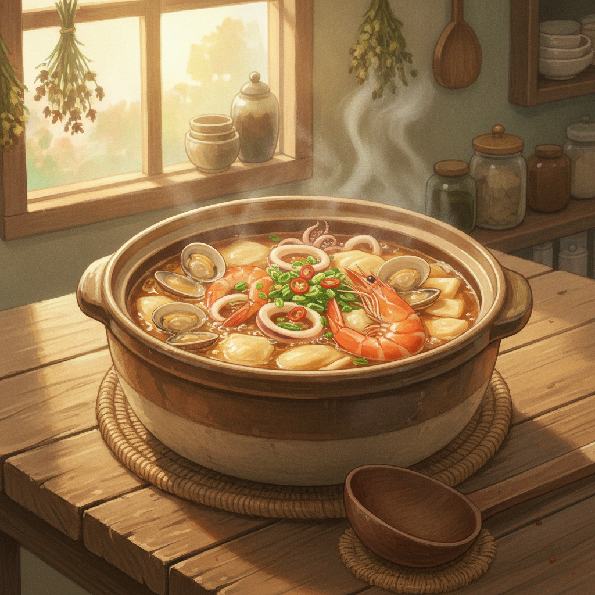

# 해물수제비 (15분 완성)

시판 수제비 반죽과 냉동 해물만 있으면 진한 국물 요리를 15분 만에 끝낼 수 있어요.

## 재료 (2인분)

- 시판 수제비 반죽 200g (또는 칼국수 생면)
- 냉동 모듬 해물 150g (오징어, 새우, 조개살 등)
- 애호박 1/4개 (반달 썰기)
- 양파 1/4개 (채 썰기)
- 대파 1/2대 (어슷 썰기)
- 다진 마늘 1작은술
- 국간장 1큰술
- 멸치액젓 1작은술
- 멸치 다시마 육수팩 1개 (또는 육수 900ml)
- 물 900ml
- 청양고추 1개 (선택)
- 소금, 후추 약간

## 조리 순서

1. **육수 끓이기 (3분)** — 냄비에 물 900ml와 육수팩을 넣고 센 불에서 끓입니다.
2. **재료 손질 (2분, 육수 끓는 동안)** — 애호박, 양파, 대파를 썰고 냉동 해물은 찬물에 살짝 헹궈 준비합니다.
3. **채소·해물 넣기 (2분)** — 육수가 끓으면 육수팩을 건져내고 양파, 애호박, 다진 마늘, 냉동 해물을 넣어 다시 끓입니다.
4. **수제비 반죽 넣기 (4분)** — 국물이 다시 끓으면 수제비 반죽을 얇게 떼어 넣고, 반죽이 떠오를 때까지 저어가며 익힙니다.
5. **간 맞추기 (2분)** — 국간장과 멸치액젓으로 간을 맞추고, 청양고추와 대파를 넣어 한소끔 더 끓입니다.
6. **마무리 (2분)** — 소금과 후추로 최종 간을 맞추고 그릇에 담아 완성합니다.

## 꿀팁

- 반죽을 최대한 얇게 떼어 넣어야 빨리 익고 쫄깃해요.
- 해물은 오래 끓이면 질겨지니 마지막 단계에 넣는 게 좋아요.
- 얼큰하게 먹고 싶다면 고춧가루 1큰술을 채소와 함께 넣어주세요.

**총 소요 시간: 약 15분**

## 지브리풍 썸네일 프롬프트 (외부 이미지 생성기용)

> Studio Ghibli style illustration, warm hand-painted anime background, a cozy wooden table with soft golden afternoon light, a rustic earthenware pot of Korean seafood sujebi (hand-torn dough soup) with shrimp, squid, and clams visible in a savory broth, hand-torn dough pieces, chopped green onion and red chili floating on top, gentle steam wisps rising, a wooden ladle resting beside the pot, whimsical and nostalgic mood, soft brush strokes, warm color palette, no text, 4:3 aspect ratio
